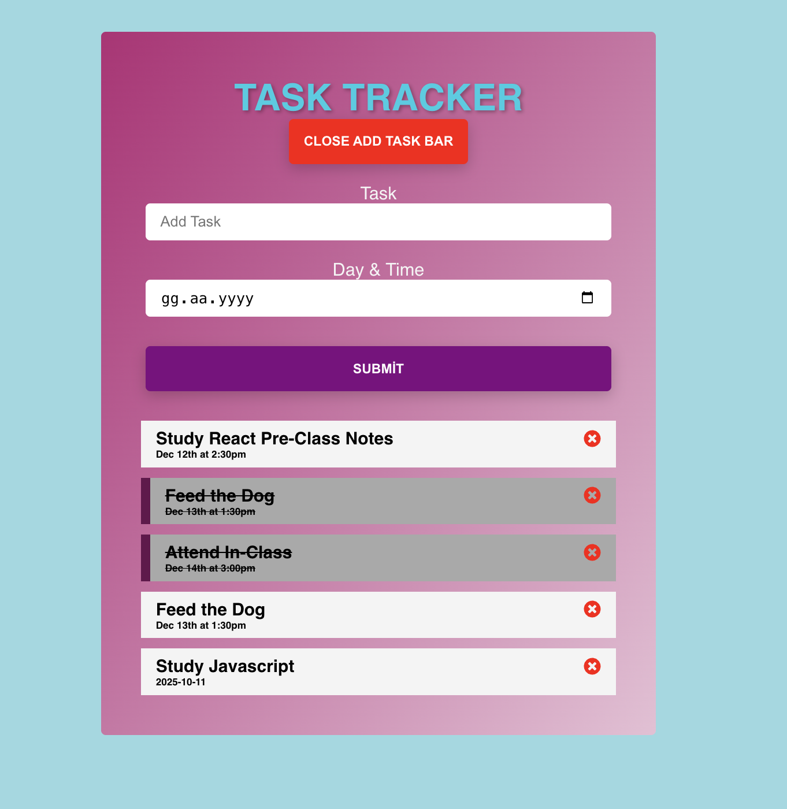
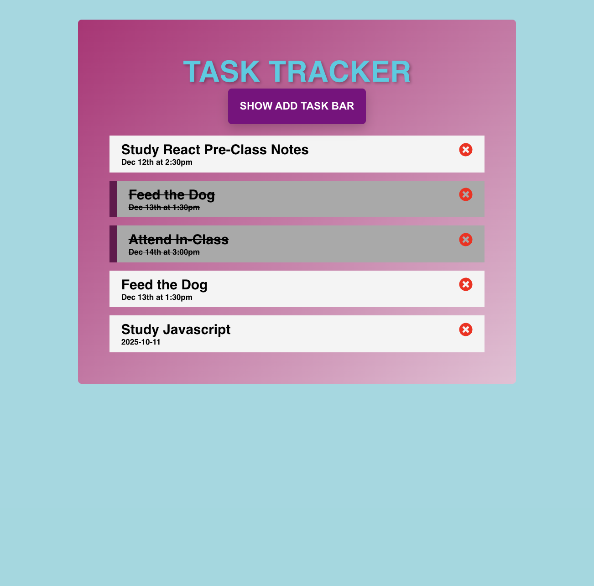

<p align="center">
  
  
  
</p>
<p align="center">
  
  
  
</p>

<h1 align="center">🚀 Persistent Taskflow</h1>

<p align="center">
  A modern, high-performance <b>React Task Management</b> application designed for efficiency. 
  It ensures an uninterrupted user experience by utilizing <b>LocalStorage persistence</b>, 
  keeping your data safe even after browser restarts.
</p>

<div align="center">
  <h3>
    <a href="https://persistent-taskflow-umitdev.vercel.app/">
      🖥️ Live Demo
    </a>
     | 
    <a href="https://github.com/umitarat-dev/Persistent-Taskflow.git">
      📂 Repository
    </a>
  </h3>
</div>

## Navigation
- [✨ Overview](#-overview)
- [📖 Description](#-description)
- [🚀 Features](#-features)
- [🗂️ Project Skeleton](#️-project-skeleton)
- [🛠️ Tech Stack](#️-tech-stack)
- [⚡ How To Use](#-how-to-use)
- [📌 About This Project](#-about-this-project)
- [🙏 Acknowledgements](#-acknowledgements)
- [📬 Contact Information](#-contact-information)
---

## ✨ Overview

A simple Task Tracker App built with React.
Users can add, delete, and mark tasks as done. All data is persisted in localStorage, so tasks remain after page reloads.

A simple Task Tracker App built with React.
Users can add, delete, and toggle tasks. Tasks are saved to localStorage so they remain after refresh.

<p align="center">
  <a href="https://persistent-taskflow-umitdev.vercel.app/">
    
  </a>
</p>

---

## 📖 Description

This project demonstrates:

* ⚛️ Using React functional components and hooks (`useState`, `useEffect`)

* 💾 LocalStorage persistence for tasks

* 🎨 Dynamic styling & conditional rendering

* ➕ Adding, ❌ deleting, ✅ marking tasks as done

---

## 🚀 Features

- **Data Persistence:** Tasks stay even after page refresh via LocalStorage.
- **Dynamic UI:** Toggleable task entry bar and real-time state updates.
- **Conditional Styling:** Visual feedback for completed tasks using double-click toggle.
- **Responsive Design:** Seamless experience across mobile and desktop.


<div align="center">   </div>

---

## 🗂️ Project Skeleton

```
Full Stack - Tutorial App
|
|----readme.md   
├── public
│     └── index.html
│  
├── src
│    ├── components
│    │       ├── Header.jsx
│    │       ├── AddTaskForm.jsx
│    │       └── ShowTasks.jsx 
│    │            
│    ├── helper
│    │       └── starterData.js
│    │
│    ├── pages
│    │       └── Home.jsx
│    │
│    ├── App.js
│    ├── App.scss
│    ├── index.js
│    └── index.css
│
├── package.json
└── yarn.lock
```

---

## 🛠️ Tech Stack

- **Frontend:** React.js
- **State Management:** Hooks (useState, useEffect)
- **Styling:** SASS / CSS3
- **Icons:** React-icons

---

## ⚡ How To Use

To clone and run this application, you'll need [Git](https://git-scm.com/), [Node.js](https://nodejs.org/), and a package manager (`yarn` or `npm`) installed on your computer.

```bash
# Clone this repository
$ git clone https://github.com/umitarat-dev/Persistent-Taskflow.git

# Navigate into the project folder
$ cd Persistent-Taskflow

# Install dependencies
$ yarn  
$ yarn start

# or using npm
$ npm install
$ npm start
```

---

## 📌 About This Project

- Built for educational purposes.
- Demonstrates state management and local persistence in React.
- Showcases conditional rendering and form handling.

---

## 🙏 Acknowledgements
- [Clarusway](https://clarusway.com/)
- [React Icons](https://react-icons.github.io/react-icons/)

---

## 📬 Contact Information

I am always open to discussing new projects, creative ideas, or opportunities to be part of your visions.

* **LinkedIn:** [linkedin.com/in/umit-arat](https://www.linkedin.com/in/umit-arat/)
* **Email:** [umitarat8098@gmail.com](mailto:umitarat8098@gmail.com)
* **GitHub:** [github.com/umitarat-dev](https://github.com/umitarat-dev) (Current Workspace)